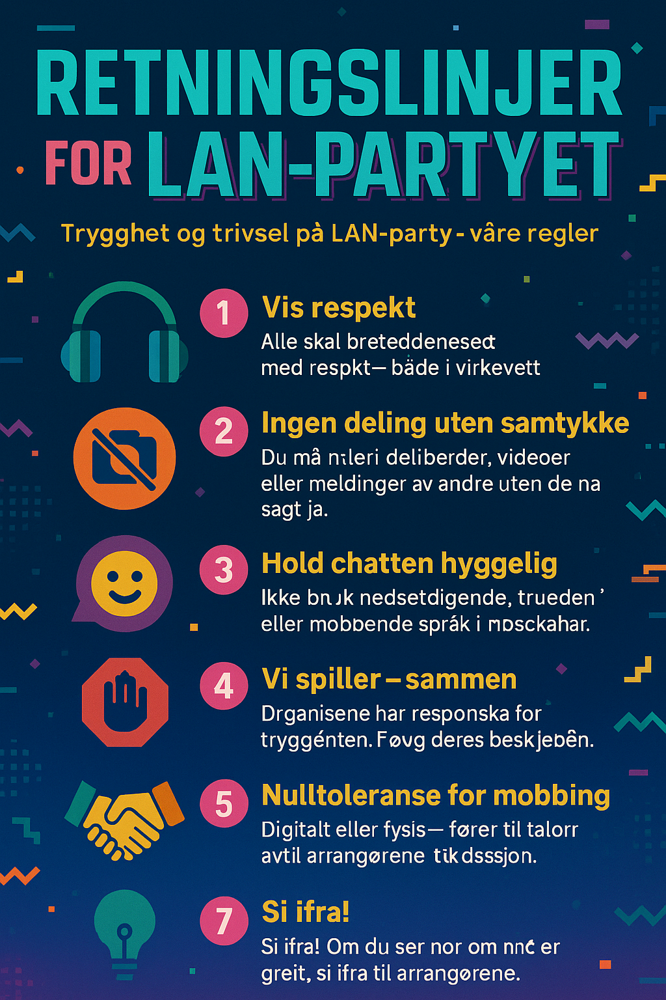

# Brukerstøtte og konflikthåndtering på LAN-party

I denne oppgaven skal jeg håndtere og forebygge konflikter i LAN-partyet sin Discord kanal.

## Del A - Håndtering av konflikten
For å håndtere denne situasjonen på best mulig måte burde man slette bildet så fort som mulig fra chatten. Etter dette burde man gi en "Timeout", som er en funksjon i Discord der man ikke lar brukeren skrive på X antall minutter, og sende en privat melding til brukeren som postet bildet.

#### Snakke med begge partene separat

Man burde snakke med personen som la ut bildet på privat melding. Hva var hensikten med å legge ut bildet? Forstår de konsekevensene av handlingen?

Man burde også snakke med personen som fikk bildet sitt lagt ut. Hvordan opplevde de situasjonen? Hva ønsker de at skal skje videre?

Målet til slutt burde være at de to partene kan snakke sammen, bli enige om noe og bli venner igjen.

Man burde også sende ut en påminnelse i Discord chatten om hvorfor det er viktig å følge reglene, og at det er viktig med respekt og trygghet for alle på LAN-et. Dette kunne man gjort som en automatisk Discord bot som sender denne meldingen hvert 30. minutt, og i tillegg når noen får en "Timeout", eller en Discord moderator sletter en melding, uten å henge ut noen personer.

## Del B - Forebygging av konflikter
For å forebygge konflikter er det viktig å ha noen grunnleggende tydelige retningslinjer i bunnen som kan hjelpe alle med å forstå hva som er galt å gjøre. 

Man burde også ha en mulighet for å anonymt snakke med arrangører/discord moderatorer for å rapportere mot ting de syntes er ugreit. Dette kan gjøres med en discord bot f. eks.

#### Her er et forslag til en liste med regler:
🎧 Vis respekt
Alle skal behandles med respekt – både i virkeligheten og på nett.

📷 Ingen deling uten samtykke
Du må aldri dele bilder, videoer eller meldinger av andre uten at de har sagt ja.

💬 Hold chatten hyggelig
Ikke bruk nedsettende, truende eller mobbende språk i Discord eller andre kanaler.

🛑 Moderatorens ord gjelder
Arrangørene har ansvar for tryggheten. Følg deres beskjeder uten diskusjon.

🤝 Vi spiller – sammen
Vær inkluderende. Det skal være rom for alle – uansett erfaring eller nivå.

🚫 Nulltoleranse for mobbing
Mobbing – digitalt eller fysisk – fører til umiddelbar reaksjon og mulig bortvisning.

💡 Si ifra!
Om du ser noe som ikke er greit, si ifra til arrangørene. Du kan gjøre det anonymt.

Her kunne man brukt elever på f.eks. VG2 Medie eller Medier og Kommunikasjon som kunne laget noen litt fancy plakater som kunne blitt printet ut og hengt opp, og sendt ut på Discord server. For å vise litt hva jeg mener har jeg brukt ChatGPT til å generere plakaten basert på reglene.

## Kilder:
https://chatgpt.com/share/684c07cd-a648-8004-88e1-ddc649698ee1 

Tidligere Tangen LAN

Tidligere undervisning